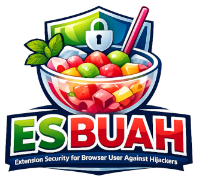

# ESBUAH (Extension Security for Browser User Against Hijackers)



### c0ded by XsanLahci

**ESBUAH** adalah _browser extension_ ringan yang dirancang khusus untuk mendeteksi ancaman pada tingkat browser, mulai dari _Adware_, _Browser Hijackers_, hingga _Credential Stealers_ yang menyamar sebagai ekstensi legal.

Dibangun dengan prinsip _DevSecOps_ dan _Red Teaming_, alat ini membantu pengguna melakukan audit integritas terhadap lingkungan browsing mereka menggunakan analisis izin heuristik dan integrasi API VirusTotal.

## 🚀 Fitur Utama

1.  **Audit Extension:** Mendeteksi ekstensi yang memiliki izin terlalu luas (_high-privilege permissions_) yang sering digunakan oleh Adware.
    
2.  **Stealer Check:** Modul khusus untuk memindai ekstensi yang memiliki akses ke data sensitif seperti `Cookies`, `Storage`, dan `Identity`.
    
3.  **VirusTotal Integration:** Melakukan pengecekan reputasi URL secara _real-time_ melalui database ancaman global VirusTotal.
    
4.  **Security Log:** Antarmuka log yang informatif untuk memantau temuan ancaman secara langsung.
    

## 📁 Struktur File

Untuk menjalankan alat ini, pastikan Anda menyimpan file dalam satu folder (misalnya folder `ESBUAH-Extension`) dengan struktur sebagai berikut:

```
ESBUAH-Extension/
├── manifest.json  (Konfigurasi Ekstensi)
├── index.html     (Antarmuka Pengguna/UI)
├── app.js         (Logika Utama & Engine)
└── esbuah.png       (Ikon Ekstensi - Ukuran 48x48 pixel)

```

## 🛠️ Cara Instalasi (Developer Mode)

Karena ini adalah _security tool_ kustom, Anda perlu memasangnya melalui mode pengembang di browser berbasis Chromium (Chrome, Edge, Brave, Opera):

1.  **Download/Clone** semua file di atas dan masukkan ke dalam satu folder.
    
2.  Buka browser dan akses halaman ekstensi:
    
    -   Chrome: `chrome://extensions/`
        
    -   Edge: `edge://extensions/`
        
3.  Aktifkan **Developer Mode** di pojok kanan atas.
    
4.  Klik tombol **Load unpacked** (Muat yang belum dikemas).
    
5.  Pilih folder tempat Anda menyimpan file **ESBUAH** tadi.
    
6.  Ekstensi ESBUAH akan muncul di daftar dan siap digunakan!
    

## ⚙️ Konfigurasi VirusTotal

Untuk menggunakan fitur _Scan URL_, Anda memerlukan API Key:

1.  Daftar akun gratis di [VirusTotal](https://www.virustotal.com/ "null").
    
2.  Buka profil Anda dan ambil **API Key** di bagian "API Key".
    
3.  Buka popup ESBUAH, masukkan key tersebut pada kolom yang tersedia. Key akan tersimpan secara otomatis di _local storage_ browser Anda.
    

## ⚠️ Disclaimer

Alat ini dikembangkan untuk tujuan edukasi dan keamanan (_SecOps_). Meskipun ESBUAH dapat mendeteksi ancaman berbasis ekstensi, alat ini tidak menggantikan fungsi Antivirus/EDR di tingkat sistem operasi (OS). Selalu berhati-hati saat memberikan izin pada ekstensi pihak ketiga.

**Coded with ⚡ by XsanLahci -** _ittampan.wordpress.com._
